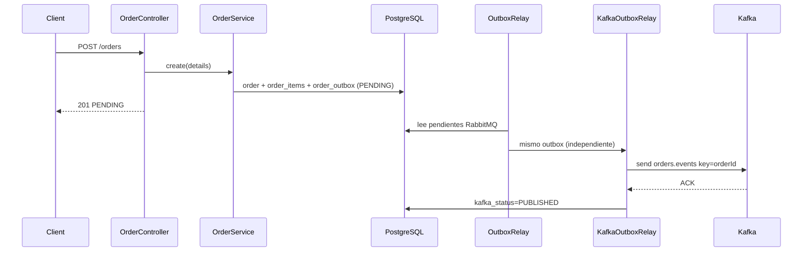
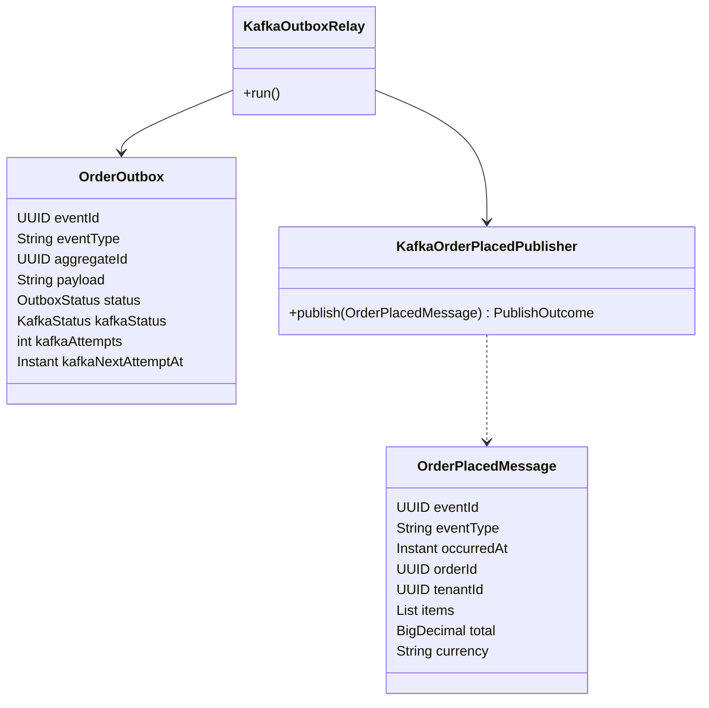

# UML 003 — Publicación de order.placed en Kafka

## Flujo principal

```mermaid
sequenceDiagram
  participant Client
  participant Controller as OrderController
  participant Service as OrderService
  participant DB as PostgreSQL
  participant Rabbit as OutboxRelay
  participant KafkaRelay as KafkaOutboxRelay
  participant Kafka

  Client->>Controller: POST /orders
  Controller->>Service: create(details)
  Service->>DB: order + order_items + order_outbox (PENDING)
  Controller-->>Client: 201 PENDING
  Rabbit->>DB: lee pendientes RabbitMQ
  Rabbit->>KafkaRelay: mismo outbox (independiente)
  KafkaRelay->>Kafka: send orders.events key=orderId
  Kafka-->>KafkaRelay: ACK
  KafkaRelay->>DB: kafka_status=PUBLISHED
```

## Estructura

```mermaid
classDiagram
  class OrderOutbox {
    UUID eventId
    String eventType
    UUID aggregateId
    String payload
    OutboxStatus status
    KafkaStatus kafkaStatus
    int kafkaAttempts
    Instant kafkaNextAttemptAt
  }
  class KafkaOutboxRelay {
    +run()
  }
  class KafkaOrderPlacedPublisher {
    +publish(OrderPlacedMessage) PublishOutcome
  }
  class OrderPlacedMessage {
    UUID eventId
    String eventType
    Instant occurredAt
    UUID orderId
    UUID tenantId
    List items
    BigDecimal total
    String currency
  }
  KafkaOutboxRelay --> OrderOutbox
  KafkaOutboxRelay --> KafkaOrderPlacedPublisher
  KafkaOrderPlacedPublisher ..> OrderPlacedMessage
```
